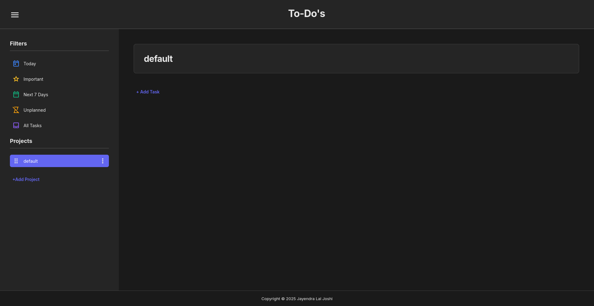

# Todo-List

A modern, responsive todo list application with local storage implementation. The app is automatically built and deployed to GitHub Pages using a GitHub Actions workflow.

## About This Project

This todo list app is a project from  [The Odin Project](https://www.theodinproject.com/lessons/node-path-javascript-todo-list) JavaScript curriculum.

## What I Learned

This project took me quite a bit of time, as it was my largest project yet and required me to do many new things, such as segmenting my code into different modules, using import/export, using class syntax, reading and writing data to JSON and locally storing it between sessions, using external libraries such as date-fns, using a comprehensive webpack setup, using extensive styling and much more. I also used technologies not covered by the curriculum to enhance the deployment process, such as GitHub Actions workflow. But my biggest challenge was figuring out how to structure my code in a clean, modular manner while taking the single responsibility principle into account, to follow best practices and make my code more scalable. Although by no means perfect, I believe I achieved my goal of successfully creating a responsive todo list application, with (for the most part) modular and cleanly separated code.

## Technologies and Tools Used

- HTML5
- CSS3
- JavaScript (ES6+)
- Webpack
- date-fns (external library)
- JSON
- Git & GitHub Pages
- GitHub Actions
- ESLint
- Prettier

## Features

- Add and manage multiple projects
- Create tasks with names, descriptions, and due dates
- Mark tasks as completed or incomplete
- Mark tasks as important
- Filter tasks by date (today, next 7 days, unplanned), importance, project or show all
- Drag and drop to reorder tasks or projects
- Edit or delete tasks and projects
- Data persists between sessions
- Responsive design for smaller screens

## Getting Started

1. Clone the repo: `git clone https://github.com/JayendraJoshi/Todo-List.git`
2. Install dependencies: `npm install`
3. Run locally: `npm run dev`
4. Build for production: `npm run build`

## Live Demo

- GitHub Pages: https://jayendrajoshi.github.io/Todo-List/
- AWS Amplify: https://gh-pages.d1no1tzsp1qxmv.amplifyapp.com/

## Screenshots

## Resources

### Icons

All icons from Material Symbols Outlined:

- Drag indicator: https://fonts.google.com/icons?selected=Material+Symbols+Outlined:drag_indicator:FILL@0;wght@400;GRAD@0;opsz@24&icon.size=24&icon.color=%231f1f1f
- More vert (options): https://fonts.google.com/icons?selected=Material+Symbols+Outlined:more_vert:FILL@0;wght@400;GRAD@0;opsz@24&icon.size=24&icon.color=%231f1f1f
- Circle (unchecked): https://fonts.google.com/icons?selected=Material+Symbols+Outlined:circle:FILL@0;wght@400;GRAD@0;opsz@24&icon.size=24&icon.color=%231f1f1f
- Check circle (completed): https://fonts.google.com/icons?selected=Material+Symbols+Outlined:check_circle:FILL@0;wght@400;GRAD@0;opsz@24&icon.size=24&icon.color=%231f1f1f
- Star (important): https://fonts.google.com/icons?selected=Material+Symbols+Outlined:star:FILL@0;wght@400;GRAD@0;opsz@24&icon.size=24&icon.color=%231f1f1f
- Today: https://fonts.google.com/icons?selected=Material+Symbols+Outlined:today:FILL@0;wght@400;GRAD@0;opsz@24&icon.size=24&icon.color=%231f1f1f
- Date range: https://fonts.google.com/icons?selected=Material+Symbols+Outlined:date_range:FILL@0;wght@400;GRAD@0;opsz@24&icon.size=24&icon.color=%231f1f1f
- Hourglass disabled (unplanned): https://fonts.google.com/icons?selected=Material+Symbols+Outlined:hourglass_disabled:FILL@0;wght@400;GRAD@0;opsz@24&icon.size=24&icon.color=%231f1f1f
- Inbox (all tasks): https://fonts.google.com/icons?selected=Material+Symbols+Outlined:inbox:FILL@0;wght@400;GRAD@0;opsz@24&icon.size=24&icon.color=%231f1f1f
- Menu: https://fonts.google.com/icons?selected=Material+Symbols+Outlined:menu:FILL@0;wght@400;GRAD@0;opsz@24&icon.size=24&icon.color=%231f1f1f

### Typography

- Inter font family: https://fonts.google.com/specimen/Inter

